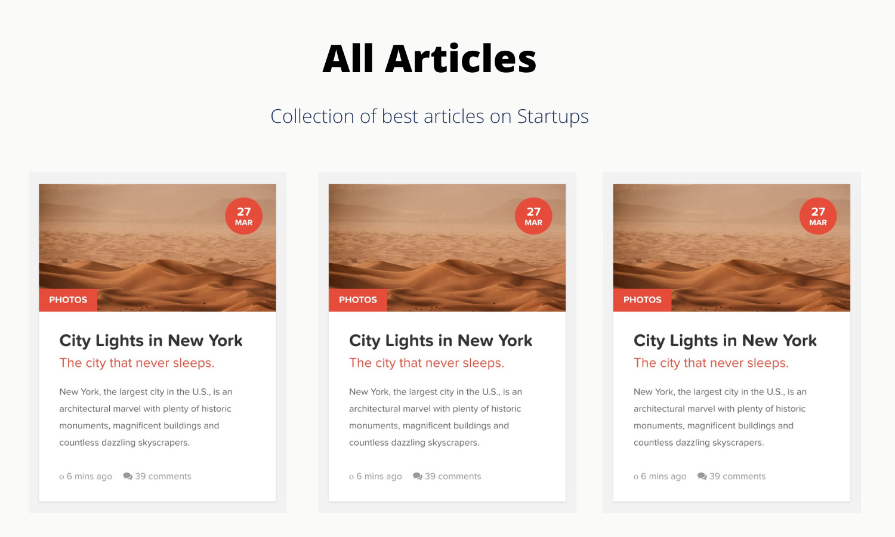

#### Create Multiple Cards Using JSX

- Create a collection of cards using JSX.
- Create a component named `Article` which will get access to props and create the individual article UI.
- You also need to create another component named `Articles` that will loop over the data given below and for each article return `Article` component.
- While using map you will also pass `props` to each individual `Article` component
- Make your UI looks like the preview given below

```js
let articles = [
  {
    title: 'City Lights in New York',
    date: new Date('2017-01-26'),
    comments: 67,
    subTitle: 'The city that never sleeps.',
    description:
      'New York, the largest city in the U.S., is an architectural marvel with plenty of historic monuments, magnificent buildings and countless dazzling skyscrapers.',
    category: 'photos',
    imageURL:
      'https://images.unsplash.com/photo-1610874933184-7728fd666162?ixid=MXwxMjA3fDB8MHxlZGl0b3JpYWwtZmVlZHwzfHx8ZW58MHx8fA%3D%3D&ixlib=rb-1.2.1&auto=format&fit=crop&w=800&q=60',
  },
  {
    title: 'Twitter’s decentralized future',
    date: new Date('2021-01-16'),
    comments: 43,
    subTitle: 'The decentralized future of twitter.',
    description:
      'The platform’s vision of a sweeping open standard could also be the far-right’s internet endgame',
    category: 'social network',
    imageURL:
      'https://techcrunch.com/wp-content/uploads/2019/09/twitter-hidden-replies1.png?resize=1536,816',
  },
  {
    title:
      'Startups look beyond lidar for autonomous vehicle perception',
    date: new Date('2017-07-26'),
    comments: 17,
    subTitle:
      'Lidar pushed ahead of traditional cameras because it could do things they couldn’t',
    description:
      'Last CES was a time of reckoning for lidar companies, many of which were cratering due to a lack of demand from a (still) non-existent autonomous vehicle industry. ',
    category: 'future',
    imageURL:
      'https://techcrunch.com/wp-content/uploads/2019/07/GettyImages-846875220.jpg?w=1390&crop=1',
  },
];
```

#### Preview





<!DOCTYPE html>
<html lang="en">
<head>
    <meta charset="UTF-8">
    <meta name="viewport" content="width=device-width, initial-scale=1.0">
    <title>Cards</title>
    <link rel="stylesheet" href="style.css">
</head>
<body>
    <div class="container">
<h2 class="header">Hello Magazine</h2>
<div id="column">

</div>
    </div>


    <script
    crossorigin
    src="https://unpkg.com/react@17/umd/react.development.js"
  ></script>

  <script
    crossorigin
    src="https://unpkg.com/react-dom@17/umd/react-dom.development.js"
  ></script>
  <script src="https://unpkg.com/@babel/standalone/babel.min.js"></script>

 <script type="text/babel">

let articles = [
  {
    title: 'City Lights in New York',
    date: new Date('2017-01-26'),
    comments: 67,
    subTitle: 'The city that never sleeps.',
    description:
      'New York, the largest city in the U.S., is an architectural marvel with plenty of historic monuments, magnificent buildings and countless dazzling skyscrapers.',
    category: 'photos',
    imageURL:
      'https://images.unsplash.com/photo-1610874933184-7728fd666162?ixid=MXwxMjA3fDB8MHxlZGl0b3JpYWwtZmVlZHwzfHx8ZW58MHx8fA%3D%3D&ixlib=rb-1.2.1&auto=format&fit=crop&w=800&q=60',
  },
  {
    title: 'Twitter’s decentralized future',
    date: new Date('2021-01-16'),
    comments: 43,
    subTitle: 'The decentralized future of twitter.',
    description:
      'The platform’s vision of a sweeping open standard could also be the far-right’s internet endgame',
    category: 'social network',
    imageURL:
      'https://techcrunch.com/wp-content/uploads/2019/09/twitter-hidden-replies1.png?resize=1536,816',
  },
  {
    title:
      'Startups look beyond lidar for autonomous vehicle perception',
    date: new Date('2017-07-26'),
    comments: 17,
    subTitle:
      'Lidar pushed ahead of traditional cameras because it could do things they couldn’t',
    description:
      'Last CES was a time of reckoning for lidar companies, many of which were cratering due to a lack of demand from a (still) non-existent autonomous vehicle industry. ',
    category: 'future',
    imageURL:
      'https://techcrunch.com/wp-content/uploads/2019/07/GettyImages-846875220.jpg?w=1390&crop=1',
  },
  
];

let root = document.getElementById("column");
  const monthname = [
"january",
"febuary",
"March",
"April",
"May",
"June",
"July",
"August",
"September",
"October",
"November",
"December",
  ]

let cardInfo = {
  title: 'City Lights in New York',
  date: new Date('2017-01-26'),
  comments: 67,
  subTitle: 'The city that never sleeps.',
  description:
    'New York, the largest city in the U.S., is an architectural marvel with plenty of historic monuments, magnificent buildings and countless dazzling skyscrapers.',
  category: 'photos',
  imageURL:
    'https://images.unsplash.com/photo-1610874933184-7728fd666162?ixid=MXwxMjA3fDB8MHxlZGl0b3JpYWwtZmVlZHwzfHx8ZW58MHx8fA%3D%3D&ixlib=rb-1.2.1&auto=format&fit=crop&w=800&q=60',
};


function Article(props){
  return(
  <div className = "post-module hover">
        <div className = "thumbnail">
            <div className="date">
<div className = "day">{props.articleInfo.date.getDate()}</div>
    <div className="month">{monthname[props.articleInfo.date.getMonth()].slice(0,3)} </div>
    </div>
    
    </div>
    <div className = "post-content">
        <div className="category">{props.articleInfo.category}</div>
        <h1 className ="title">{props.articleInfo.title}</h1>      
        <h2 className = "subtitle">{props.articleInfo.subTitle}</h2>
        <p className="description">{props.articleInfo.description}</p>
        <div className ="post-meta">
            <span className ="comments">
                <i className = "fa fa-comments"></i>
                    <a href="#">{props.articleInfo.comments}Comments</a>
                    </span>
                    </div>
                    </div>
                    </div>   
  )
}
   function Articles() {
    return articles.map((article)=> <Article articleInfo = {article} />)
   }
    
ReactDOM.render(<Articles />, root);

 </script>
</body>
</html>


