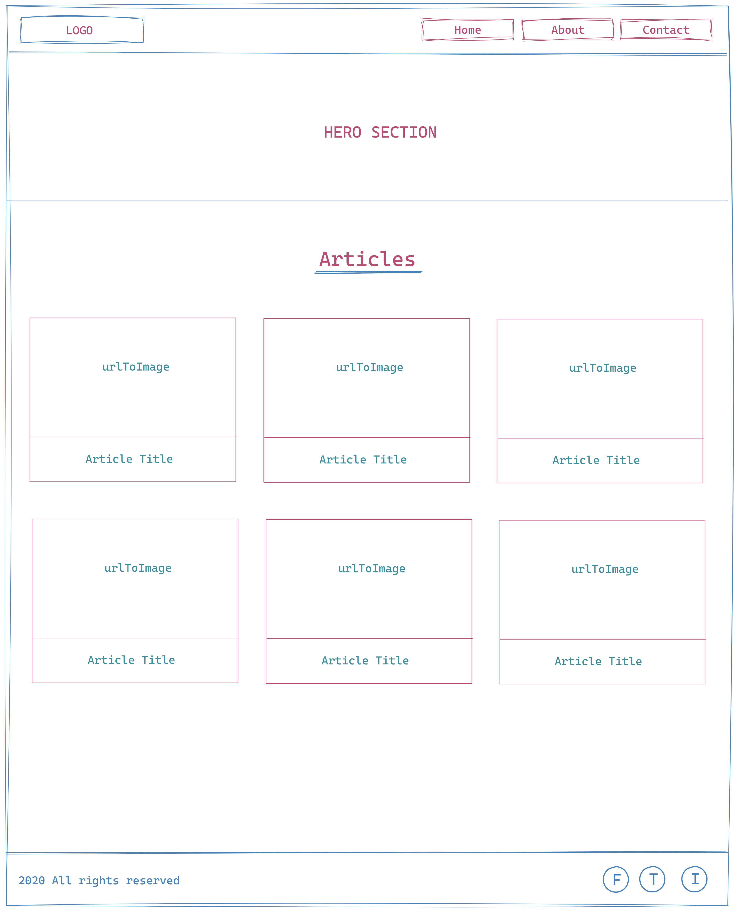

#### Create Article Card Using JSX

- Create a news app similar to the one give in preview (named Gizmo)..
- Break down the home page into different components.
- It needs to have all these components `Header, Hero, Articles, Article, Footer`
- Use the data given below to create the articles with different information
- The blueprint for the UI is given. Follow the patterns given in the preview and add anything you want.

#### Preview



```js
[
  {
    author: 'Omkar Godbole',
    title:
      'Third Halving Turns Out to Be Non-Event for Bitcoin’s Price',
    description:
      "Bitcoin's price volatility has declined following the network's third mining reward halving event on Monday.",
    url:
      'https://www.coindesk.com/third-blockchain-halving-turns-out-non-event-bitcoins-price',
    urlToImage:
      'https://static.coindesk.com/wp-content/uploads/2020/05/btc-chart-may-12-1200x628.png',
    publishedAt: '2020-05-12T11:40:34Z',
    content:
      "Bitcoin's price volatility has declined following the network's third mining reward halving event on Monday.  \r\nThe reward per block mined on bitcoin's blockchain was reduced to 6.25 BTC from 12.5 BTC at 19:23 UTC, when the cryptocurrency was trading near $8,… [+3792 chars]",
  },
  {
    author: 'Samuel Haig',
    title:
      'Gibraltar Financial Services Minister Talks ‘Staying Ahead’ on DLT',
    description:
      'Gibraltar’s minister for digital and financial services spoke to Cointelegraph about regulating market manipulation in the blockchain sector.',
    url:
      'https://cointelegraph.com/news/gibraltar-financial-services-minister-talks-staying-ahead-on-dlt',
    urlToImage:
      'https://s3.cointelegraph.com/storage/uploads/view/353dbd86242a1d269f2c88dee06f347b.jpg',
    publishedAt: '2020-05-12T11:24:00Z',
    content:
      'The British Overseas Territory of Gibraltar, a pioneer of blockchain-friendly regulations, will introduce a new regulatory principle for the DLT sector addressing market manipulation risks in the coming months.\r\nIn an interview with Cointelegraph, Albert Isol… [+9060 chars]',
  },
  {
    author: 'Joseph Young',
    title:
      "4 Reasons the Bitcoin Halving Won't Trigger a Big ‘Miner Capitulation’",
    description:
      'Bitcoin miners are not likely to see capitulation and especially a “mining death spiral” after the 2020 halving due to four major reasons.',
    url:
      'https://cointelegraph.com/news/4-reasons-the-bitcoin-halving-wont-trigger-a-big-miner-capitulation',
    urlToImage:
      'https://s3.cointelegraph.com/storage/uploads/view/d48310014a898546a95b35ed741b8eac.jpg',
    publishedAt: '2020-05-12T11:08:00Z',
    content:
      'A popular narrative revolving around the Bitcoin (BTC) halving is that it may trigger the capitulation of miners. But, it is premature to suggest many miners will shut down in 2020 and bring the price of cryptocurrencies down as a result.\r\nSome industry execu… [+4090 chars]',
  },
  {
    author: 'Web Editor',
    title:
      'Coronavirus-related Cyber Attacks jump 30% in past two weeks - TEISS',
    description:
      'In the past two weeks, Check Point researchers have documented an average of 192,000 coronavirus-related cyber attacks per week, marking a 30% increase compared to previous weeks. Researchers found that a majority of these attacks start with phishing emails i…',
    url:
      'https://www.teiss.co.uk/coronavirus-related-cyber-attacks-jump-30-in-past-two-weeks/',
    urlToImage:
      'https://s31405.pcdn.co/wp-content/uploads/2020/05/iStock-1177170875.jpg',
    publishedAt: '2020-05-12T11:04:00Z',
    content:
      'The World Health Organizations name and logo is a popular choice for hackers to impersonate. Recently, cyber criminals sent malicious emails posing as the WHO from the domain who.int with the email subject Urgent letter from WHO: First human COVID-19 vaccine … [+4458 chars]',
  },
  {
    author: 'Nick Chong',
    title:
      'Analysts Fear “Extreme” Post-Halving Bitcoin Capitulation: Why That’s Good',
    description:
      'On Monday, the Bitcoin block reward halving finally came to pass. It was an exciting event celebrated by tens of thousands of cryptocurrency investors, with thousands packing into celebratory live streams, tens of thousands liking halving tweets, and hundreds…',
    url:
      'https://www.newsbtc.com/2020/05/12/analysts-fear-extreme-post-halving-bitcoin-capitulation-why-this-isnt-bad/',
    urlToImage:
      'https://www.newsbtc.com/wp-content/uploads/2020/05/jackson-david-WUydTfaP3t4-unsplash-1200x780.jpg',
    publishedAt: '2020-05-12T11:00:42Z',
    content:
      'On Monday, the Bitcoin block reward halving finally came to pass.\r\nIt was an exciting event celebrated by tens of thousands of cryptocurrency investors, with thousands packing into celebratory live streams, tens of thousands liking halving tweets, and hundred… [+3113 chars]',
  },

  {
    author: 'Satoshi Nakaboto',
    title:
      'Kronoverse Leaves Ethereum-based Enjin System to Use Bitcoin SV to Tokenize Esports In-game Items',
    description:
      "LONDON, May 12, 2020 /PRNewswire/ -- eSports games creator, Kronoverse, and its competitive strategy game CryptoFights, have moved to the Bitcoin SV blockchain to tokenize users' in–game items because of the lack of scalability of the Ethereum blockchain. Pre…",
    url:
      'https://www.prnewswire.com/news-releases/kronoverse-leaves-ethereum-based-enjin-system-to-use-bitcoin-sv-to-tokenize-esports-in-game-items-301057499.html',
    urlToImage:
      'https://www.prnewswire.com/content/dam/prnewswire/common/prn_facebook_sharing_logo.jpg',
    publishedAt: '2020-05-12T11:00:00Z',
    content:
      "LONDON, May 12, 2020 /PRNewswire/ -- eSports games creator, Kronoverse, and its competitive strategy game CryptoFights, have moved to the Bitcoin SV blockchain to tokenize users' ingame items because of the lack of scalability of the Ethereum blockchain. \r\nPr… [+1773 chars]",
  },
  {
    author: 'Boris Cumbo',
    title:
      '5 Mistakes Every New Crypto Trader Should Avoid',
    description:
      'The crypto industry is relatively new. Because of that, people need time to adapt to it. You will…\nThe post 5 Mistakes Every New Crypto Trader Should Avoid appeared first on The Frisky.',
    url:
      'https://thefrisky.com/mistakes-crypto-trader-should-avoid/',
    urlToImage:
      'https://thefrisky.com/wp-content/uploads/2020/05/crypto-trader.jpg',
    publishedAt: '2020-05-12T09:09:22Z',
    content:
      'The crypto industry is relatively new. Because of that, people need time to adapt to it. You will find people that are skeptical about this subject. They believe that cryptocurrencies will never replace fiat money. More precisely, you will hear them saying th… [+6128 chars]',
  },
];
```

style
*{
margin: 0;
padding: 0;
}


/* Reset default styles */
body, ul {
  margin: 0;
  padding: 0;
}

/* Global styles */
.container {
  max-width: 1200px;
  margin: 0 auto;
  padding: 0 20px;
}

.wrapper {
  padding: 40px;
}

/* Header styles */
.header {
  background-color: #333;
  color: #fff;
  padding: 20px 0;
}

.header h1 {
  margin: 0;
  padding: 10px;
  font-size: 2.5rem;
}

.header ul {
  list-style: none;
  display: flex;
  padding: 0;
}

.header li {
  margin-right: 20px;
  cursor: pointer;
  font-size: 1.2rem;
}

/* Hero styles */
.hero {
  background-color: #007bff;
  color: #fff;
  padding: 60px 0;
  text-align: center;
}

.hero h1 {
  margin: 0;
  padding: 10px;
  font-size: 3rem;
}

.hero article {
  margin-top: 20px;
  font-size: 1.2rem;
}

/* Article styles */
.articles {
  padding: 40px;
}

.articles ul {
  list-style: none;
  padding: 0;
  display: grid;
  grid-template-columns: repeat(auto-fill, minmax(300px, 1fr));
  gap: 20px;
}

.articles li {
  border: 1px solid #ddd;
  padding: 20px;
  background-color: #fff;
  border-radius: 8px;
  box-shadow: 0 2px 4px rgba(0, 0, 0, 0.1);
}

.articles img {
  max-width: 100%;
  height: auto;
  margin-bottom: 10px;
  border-radius: 6px;
}

.articles h3 {
  margin: 10px 0;
  font-size: 1.5rem;
}

.articles p {
  margin: 0 0 10px;
  font-size: 1.1rem;
}

.articles a {
  color: #007bff;
  text-decoration: none;
}

/* Footer styles */
.footer {
  background-color: #333;
  color: #fff;
  padding: 20px 0;
  text-align: center;
}

.footer p {
  margin: 0;
}

/* Media queries */
@media (max-width: 768px) {
  .articles ul {
    grid-template-columns: repeat(auto-fill, minmax(100%, 1fr));
  }
}
app.js
import Header from "./header";
import Hero from "./Hero"
import Articles from "./Articles";
import Footer from "./Footer";

function App(){
    return (
    <>
        <Header/>
        <main className="wrapper">
        <Hero/>
<Articles />
        </main>
<Footer/>
        </>
    )

}


export default App;
articles.js

let allArticles = [
    {
      author: 'Omkar Godbole',
      title:
        'Third Halving Turns Out to Be Non-Event for Bitcoin’s Price',
      description:
        "Bitcoin's price volatility has declined following the network's third mining reward halving event on Monday.",
      url:
        'https://www.coindesk.com/third-blockchain-halving-turns-out-non-event-bitcoins-price',
      urlToImage:
        'https://static.coindesk.com/wp-content/uploads/2020/05/btc-chart-may-12-1200x628.png',
      publishedAt: '2020-05-12T11:40:34Z',
      content:
        "Bitcoin's price volatility has declined following the network's third mining reward halving event on Monday.  \r\nThe reward per block mined on bitcoin's blockchain was reduced to 6.25 BTC from 12.5 BTC at 19:23 UTC, when the cryptocurrency was trading near $8,… [+3792 chars]",
    },
    {
      author: 'Samuel Haig',
      title:
        'Gibraltar Financial Services Minister Talks ‘Staying Ahead’ on DLT',
      description:
        'Gibraltar’s minister for digital and financial services spoke to Cointelegraph about regulating market manipulation in the blockchain sector.',
      url:
        'https://cointelegraph.com/news/gibraltar-financial-services-minister-talks-staying-ahead-on-dlt',
      urlToImage:
        'https://s3.cointelegraph.com/storage/uploads/view/353dbd86242a1d269f2c88dee06f347b.jpg',
      publishedAt: '2020-05-12T11:24:00Z',
      content:
        'The British Overseas Territory of Gibraltar, a pioneer of blockchain-friendly regulations, will introduce a new regulatory principle for the DLT sector addressing market manipulation risks in the coming months.\r\nIn an interview with Cointelegraph, Albert Isol… [+9060 chars]',
    },
    {
      author: 'Joseph Young',
      title:
        "4 Reasons the Bitcoin Halving Won't Trigger a Big ‘Miner Capitulation’",
      description:
        'Bitcoin miners are not likely to see capitulation and especially a “mining death spiral” after the 2020 halving due to four major reasons.',
      url:
        'https://cointelegraph.com/news/4-reasons-the-bitcoin-halving-wont-trigger-a-big-miner-capitulation',
      urlToImage:
        'https://s3.cointelegraph.com/storage/uploads/view/d48310014a898546a95b35ed741b8eac.jpg',
      publishedAt: '2020-05-12T11:08:00Z',
      content:
        'A popular narrative revolving around the Bitcoin (BTC) halving is that it may trigger the capitulation of miners. But, it is premature to suggest many miners will shut down in 2020 and bring the price of cryptocurrencies down as a result.\r\nSome industry execu… [+4090 chars]',
    },
    {
      author: 'Web Editor',
      title:
        'Coronavirus-related Cyber Attacks jump 30% in past two weeks - TEISS',
      description:
        'In the past two weeks, Check Point researchers have documented an average of 192,000 coronavirus-related cyber attacks per week, marking a 30% increase compared to previous weeks. Researchers found that a majority of these attacks start with phishing emails i…',
      url:
        'https://www.teiss.co.uk/coronavirus-related-cyber-attacks-jump-30-in-past-two-weeks/',
      urlToImage:
        'https://s31405.pcdn.co/wp-content/uploads/2020/05/iStock-1177170875.jpg',
      publishedAt: '2020-05-12T11:04:00Z',
      content:
        'The World Health Organizations name and logo is a popular choice for hackers to impersonate. Recently, cyber criminals sent malicious emails posing as the WHO from the domain who.int with the email subject Urgent letter from WHO: First human COVID-19 vaccine … [+4458 chars]',
    },
    {
      author: 'Nick Chong',
      title:
        'Analysts Fear “Extreme” Post-Halving Bitcoin Capitulation: Why That’s Good',
      description:
        'On Monday, the Bitcoin block reward halving finally came to pass. It was an exciting event celebrated by tens of thousands of cryptocurrency investors, with thousands packing into celebratory live streams, tens of thousands liking halving tweets, and hundreds…',
      url:
        'https://www.newsbtc.com/2020/05/12/analysts-fear-extreme-post-halving-bitcoin-capitulation-why-this-isnt-bad/',
      urlToImage:
        'https://www.newsbtc.com/wp-content/uploads/2020/05/jackson-david-WUydTfaP3t4-unsplash-1200x780.jpg',
      publishedAt: '2020-05-12T11:00:42Z',
      content:
        'On Monday, the Bitcoin block reward halving finally came to pass.\r\nIt was an exciting event celebrated by tens of thousands of cryptocurrency investors, with thousands packing into celebratory live streams, tens of thousands liking halving tweets, and hundred… [+3113 chars]',
    },
  
    {
      author: 'Satoshi Nakaboto',
      title:
        'Kronoverse Leaves Ethereum-based Enjin System to Use Bitcoin SV to Tokenize Esports In-game Items',
      description:
        "LONDON, May 12, 2020 /PRNewswire/ -- eSports games creator, Kronoverse, and its competitive strategy game CryptoFights, have moved to the Bitcoin SV blockchain to tokenize users' in–game items because of the lack of scalability of the Ethereum blockchain. Pre…",
      url:
        'https://www.prnewswire.com/news-releases/kronoverse-leaves-ethereum-based-enjin-system-to-use-bitcoin-sv-to-tokenize-esports-in-game-items-301057499.html',
      urlToImage:
        'https://www.prnewswire.com/content/dam/prnewswire/common/prn_facebook_sharing_logo.jpg',
      publishedAt: '2020-05-12T11:00:00Z',
      content:
        "LONDON, May 12, 2020 /PRNewswire/ -- eSports games creator, Kronoverse, and its competitive strategy game CryptoFights, have moved to the Bitcoin SV blockchain to tokenize users' ingame items because of the lack of scalability of the Ethereum blockchain. \r\nPr… [+1773 chars]",
    },
    {
      author: 'Boris Cumbo',
      title:
        '5 Mistakes Every New Crypto Trader Should Avoid',
      description:
        'The crypto industry is relatively new. Because of that, people need time to adapt to it. You will…\nThe post 5 Mistakes Every New Crypto Trader Should Avoid appeared first on The Frisky.',
      url:
        'https://thefrisky.com/mistakes-crypto-trader-should-avoid/',
      urlToImage:
        'https://thefrisky.com/wp-content/uploads/2020/05/crypto-trader.jpg',
      publishedAt: '2020-05-12T09:09:22Z',
      content:
        'The crypto industry is relatively new. Because of that, people need time to adapt to it. You will find people that are skeptical about this subject. They believe that cryptocurrencies will never replace fiat money. More precisely, you will hear them saying th… [+6128 chars]',
    },
  ];


  export default allArticles;
header.js
function Header(){

    return (
        <div className="container">
        <h1>GIZMO</h1>,
<ul>
    <li>Home</li>
    <li>Contact</li>
    <li>About</li>
</ul>
</div>)

}

export default Header;

hero.js
function Hero(){
    return(
    <section className="hero">
<h1>Learn More </h1>
<article>
    <p>Explore All The Local News About StartUp</p>
</article>

    </section>
    )
}

export default Hero;

Article.js
function Article(props){
return(
<li>
<figure>

<figcaption>
<h3>{props.title}</h3>
</figcaption>
</figure>
<p>{props.description}</p>
<a href= {props.url}>Read More </a>
</li>
)
}


export default Article;

Articles.js

import Article from "./Article";
import allArticles from "./data/articles";

function  Articles(){
    return (
        <section className="articles" id="articles" >,
        <ul>
{allArticles.map((article)=> (
    <Article key ={article.publishedAt} {...article}/>
))} 
        </ul>
</section>
    )
    }


 export default Articles;


footer.js
function Footer(){
    return (
      <footer>
        <p>&copy; 2023. GIZMO</p>
      </footer>
        
    )
}
 export default Footer;


